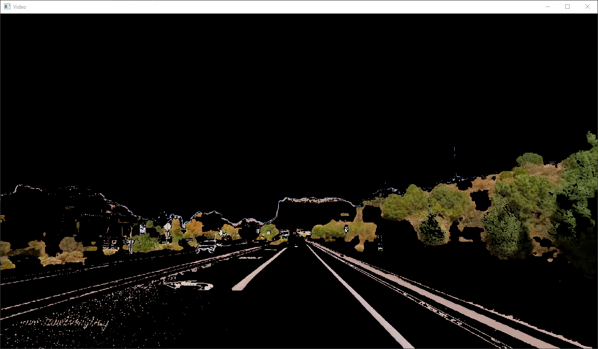
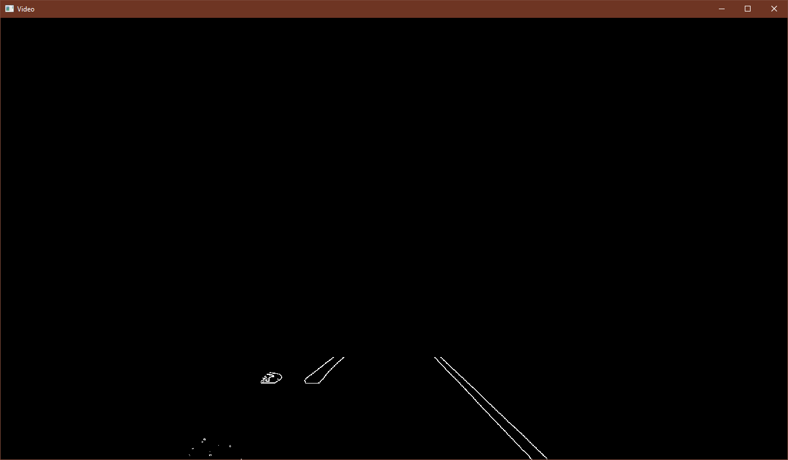
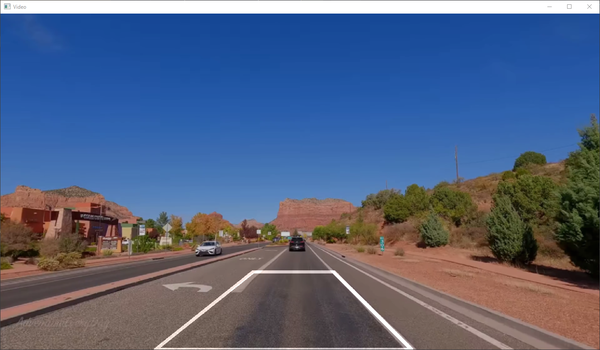
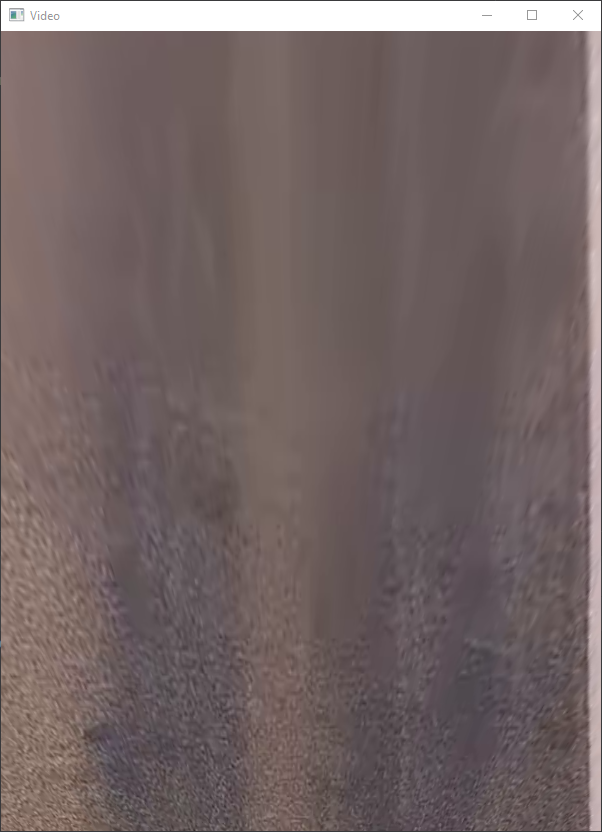

# Построение дорожного полотна по видео
### Сделано в рамках тестового задания по интернатуре в Singularis
---

Цель работы - реализовать алгоритм для генерации полотна дороги по записи с видео-регистратора.
На вход программе подается путь к видео-файлу с записью проезда на автомобиле.
На выходе ожидается изображение дороги с “видом сверху”, составленное из кадров исходного видео.

Условия задания:
>  1. Считаем, что на видео автомобиль движется по прямой дороге без поворотов, холмов и кочек;
>  2. Все исходные видео относятся к проезду на одном и том же автомобиле (т.е. положение камеры предполагается одинаковым на всех видео);
>  3. Допускается использование заранее заданного четырехугольника перспективы (четыре точки, обозначающие границы дороги, которые помогут построить перспективное    преобразование);
>  4. Реализация алгоритма автоматической оценки перспективного искажения дороги будет плюсом;
>  5. Допускается, если скрипт корректно отрабатывает хотя бы на одном из предложенных видео целиком;
>  6. Сгенерировать можно как изображение для одной полосы, по которой движется автомобиль, так и всего полотна дороги - на ваше усмотрение.

Написано на Python 3.12.0.
Использованные библиотеки:
- opencv-python
- numpy
- tqdm
---

## Подготовка к запуску

- Клонируем данный репозиторий куда удобно:
```bash
git clone https://github.com/daisccho/road_capture.git
```
- Переходим в папку с проектом и создаем виртуальное окружение, активируем его:
```bash
cd .\road_capture\
python -m venv venv
.\venv\Scripts\activate.bat
```
- Устанавливаем библиотеки:
```bash
pip install -r .\requirements.txt
```

## Использование

```bash
python .\src\main.py input_video output_image

# Аргументы:
#  input_video   Путь к видео (например, .\media\redrock1.mp4)
#  output_image  Путь для сохранения результирующего изображения (например, .\results\result.png)
```
Проект уже содержит четыре предложенных видео, так что можно воспользоваться ими.

## Описание работы программы

Поиск границ полосы, по которой едет автомобиль, реализован через последовательность следующих действий:
- Поиск линий разметки с помощью цветового фильтра.</br>
`(переводим картинку в цветовое пространство HSL и ищем белые и желтые полосы)`

- Поиск границы найденных линий с помощью адаптивного трешхолда.</br>
  `(можно было, конечно, применить алгоритм Кэнни, но при сравнении результатов адаптивный трешхолд мне показался более приемлемым вариантом, т.к. он лучше убирает шумы после цветового фильтра)`

- Поиск линий с помощью преобразования Хафа, их сортировка на левые и правые по наклону и усреднение до одной единственной, показывающей положение линии разметки.


В итоге мы получаем полигон, выделяющий интересующий нас участок на видео. Мы знаем координаты этого полигона, поэтому мы можем изменить его перспективу с помощью `cv.warpPerspective()`. 
<div align="center">
  <a href="./">
    
  </a>
</div>
Остается только объединить поток кадров в одно изображение со смещением, чтобы получить полное полотно дороги.
<div align="center">
  <a href="./">
    
  </a>
</div>

## Результаты

- Для первых трёх видео (redrock1, redrock2, redrock4) программа генерирует стабильные карты дорог (насколько это позволяет моя реализация).
- С четвёртым видео (redrock5) возникают проблемы, т.к. при подобранных мною фильтрах левая полоса пропадает после обработки кадра. В этом случае (когда какая-либо из линий отсутствует) алгоритм отражает противоположную. Из-за этого часть дороги на изображении немного сжата к правой стороне. Где-то после середины видео алгоритму удается различить полосу, отчего ближе к концу дорога выглядит более стабильнее.
- Результаты работы можно посмотреть в папке `results/`.
